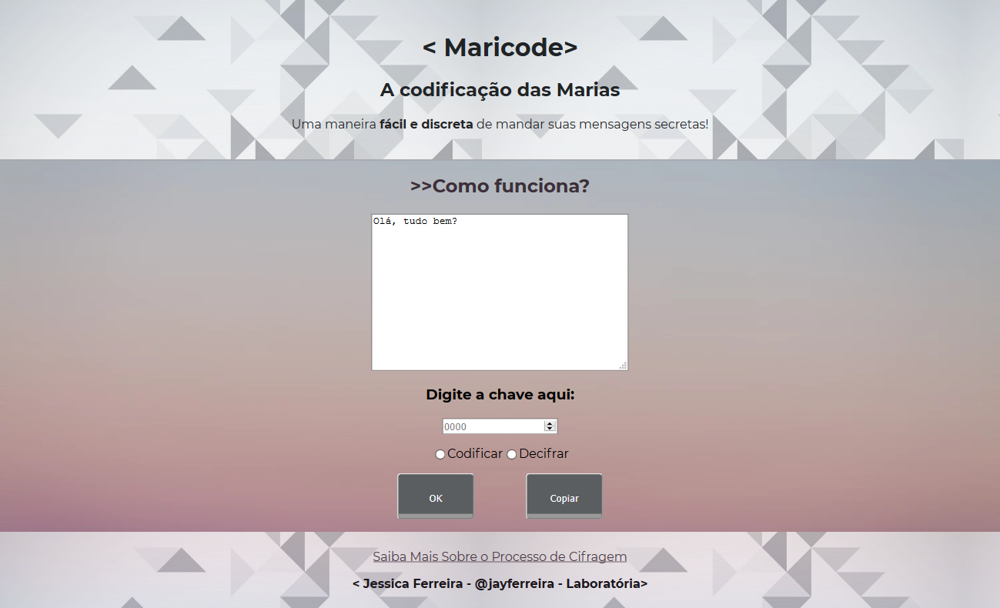

# < Maricode >

> Projeto apresentado à Laboratória-Brasil.  A partir da situação problema proposta, criar uma aplicação que permita criptografar e descriptografar mensagens.

 

#### O Problema
"O aniversário da sua mãe está se aproximando e você está organizando uma festa surpresa. Para manter a festa em segredo foi criado um grupo de Whatsapp com amigos e familiares. O problema é que as vezes sua mãe utiliza o seu celular e pode ser que ela veja as suas mensagens. Como a festa é surpresa, você decide criar uma aplicação que permita enviar mensagens criptografadas e depois descriptografar. Então agora é a hora de aplicar os seus super poderes 😎"

## Sobre o nome
Levando em conta as clientes ( meu grupo do Whatsapp da família )  e os objetivos do projeto, surgiu o nome "Maricode". Ele é uma junção de **Maricotas** (que é como elas carinhosamente se chamam) e **Code**  de código. O nome foi super bem recebido pelas clientes. 

## Sobre a Interface 
Foram utilizadas cores contrastantes e botões grandes para melhor acessibilidade em celular. 
Na versão atual, conta com instruções de uso em um modal para otimização do espaço visível.

## Objetivos de Aprendizagem
Construir uma aplicação web, utilizando conhecimentos de  **User Experience Design**  e de  **JavaScript**. 

 - Desenhar um produto pensando nos usuários,
 - Construir uma interface, 
- Escutar eventos básicos do DOM, 
- Escrever a lógica que cifra e descifra mensagens, 
- Realizar testes básicos que comprovem (e documentem) esta lógica, 
- Manipular o DOM para que ele mostre e imprima os resultados.

## A lógica por trás do Maricode
Através de funções, o programa Maricode realiza a cifragem de mensagens por meio do processo de  **cifra de troca**  ou  **Cifra de César**. Este processo consiste em um deslocamento do alfabeto por um número padrão. Criando assim mensagens criptografadas onde cada letra é substituída por outra. Em uma troca de 1 posição, A se tornaria B, B se tornaria C e assim consecutivamente.

 

