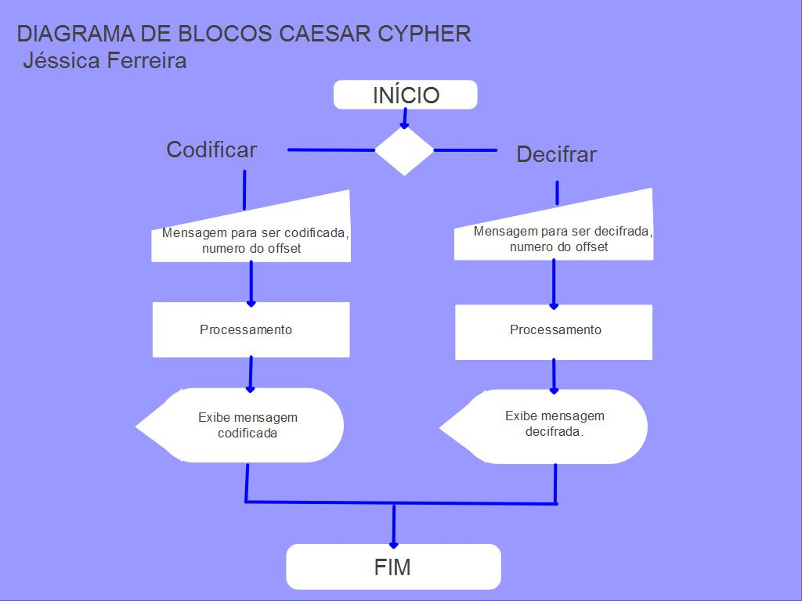

# < Maricode > 

## O que é?
Uma aplicação web que possibilita ao usuário **criptografar e descriptografar** mensagens para serem enviadas em grupos de Whatsapp.

## Como funciona?
Através de funções, o programa Maricode realiza a cifragem de mensagens por meio do processo de **cifra de troca** ou **Cifra de César**. Este processo consiste em um deslocamento do alfabeto por um número padrão. Criando assim mensagens criptografadas onde cada letra é substituída por outra. Em uma troca de 1 posição, A se tornaria B, B se tornaria C e assim consecutivamente.

## Como usar? 
O usuário insere a mensagem que deseja enviar no campo 'Codificar', escolhe o offset de deslocamento na cifra no campo 'Senha' e clica no botão. O programa então irá exibir a mensagem codificada.  
Caso o usuário tenha recebido uma mensagem codificada, deverá inseri-la no campo 'Decodificar', informar a 'senha' recebida pelo usuário que codificou a mensagem e clicar no botão. O programa irá exibir a mensagem decodificada.

